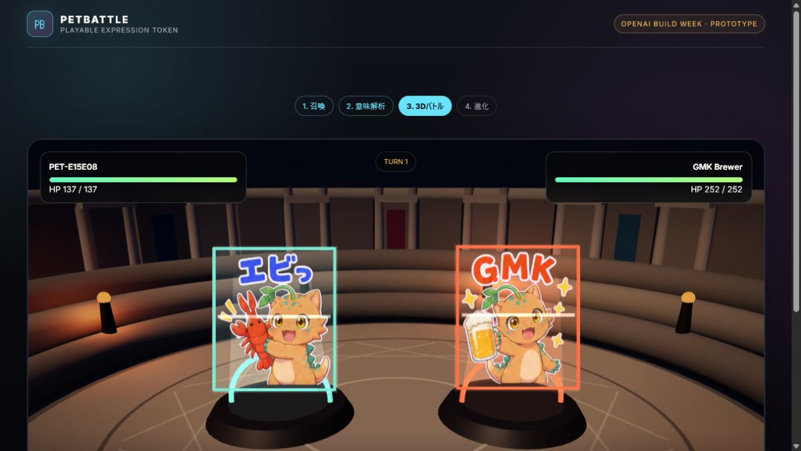

# PETBATTLE

**あらゆる表現を、戦える存在へ。**

PETBATTLEは、画像や生成物を「Playable Expression Token（PET）」へ変換し、3Dコロシアムで対戦させる表現学習ゲームです。ファイル容量やAPIトークン消費量ではなく、作品から説明できる意味だけを16個のエッセンスへ正規化します。

ハッカソン版では、JPEG・PNG・WebPからPETを召喚し、物理・魔法・防御の三すくみとカウンターを使ってCPUまたはオンラインの相手と戦えます。

## デモ

[](public/demo/petbattle-demo.mp4)

画像召喚、自分のPET Core能力値の可視化、コロシアム導入、カウンターを含む16秒のブラウザデモです。

## 体験の流れ

1. 画像をアップロードする
2. ローカル特徴量と任意のGPT-5.6 Luna解析から「何を作ったか」を認識する
3. 意味エッセンスを固定ルールでPET Core能力値へ変換する
4. 魔法陣から自分のPETを召喚し、伏せられた敵PETを3Dコロシアム開戦時に初公開する
5. `物理 > 魔法 > 防御 > 物理` と防御カウンターで対戦する
6. レベルアップし、扱える容量・形式・意味の解像度を増やす

## なぜ教育なのか

PETを強くするには、大量生成ではなく「自分が何を表現したか」を改善する必要があります。成長に合わせてSVG、コード、3D、PDF、IFCなどが解放され、プレイヤーが新しい制作手段や変換プログラムを学ぶ動機になります。AIは採点者ではなく意味を読む補助役で、能力値と勝敗は検証可能なゲームルールが決めます。

## ローカル起動

Node.js 20以降を使います。

```powershell
npm install
npm run dev
```

品質確認:

```powershell
npm test
npm run typecheck
npm run lint
npm run build
```

OpenAI APIやWorkerが未設定でも、決定論的なローカル解析とCPU戦はそのまま遊べます。

OSの「視差効果を減らす」を尊重します。審査デモで開始演出を明示的に再生する場合はURLへ `?motion=full`、縮小版を確認する場合は `?motion=reduced` を付けられます。

## Luna解析と通信対戦

秘密のAPIキーをGitHub Pagesへ置かないため、Cloudflare Workerを境界にします。同じWorkerが意味解析APIとDurable Objectによる2人対戦を提供します。

```powershell
npx wrangler secret put OPENAI_API_KEY --config worker/wrangler.jsonc
npx wrangler deploy --config worker/wrangler.jsonc
```

`.env.example` を `.env.local` へコピーし、デプロイされたWorker URLを設定します。

```dotenv
VITE_LUNA_WORKER_URL=https://petbattle-luna.example.workers.dev
VITE_BATTLE_WORKER_URL=https://petbattle-luna.example.workers.dev
```

- `POST /analyze`: 画像の意味候補を `gpt-5.6-luna` で構造化抽出
- `GET /room/:roomId?playerId=...`: WebSocketで2人の秘密行動を収集し、権威的にターンを解決
- 画像SHA-256・モデル・schema version単位で解析結果をキャッシュ
- API失敗時はブラウザの固定解析へフォールバック

Workerの詳細は [worker/README.md](worker/README.md) を参照してください。

## GitHub Pages

`main` ブランチへpushすると、`.github/workflows/deploy-pages.yml` がテストとビルドを行い、`dist` をGitHub Pagesへ公開します。Viteのbase pathはActions上でリポジトリ名から自動設定されます。

Repository Settingsの **Pages > Build and deployment > Source** を **GitHub Actions** に設定してください。
Workerを接続する場合は、同じくRepository Settingsの **Secrets and variables > Actions > Variables** に `VITE_LUNA_WORKER_URL` と `VITE_BATTLE_WORKER_URL` を登録します。値は公開される接続先URLであり、APIキーではありません。

## 構成

```text
src/core/artifact.ts     形式検証、特徴抽出、意味エッセンス、能力値
src/core/battle.ts       決定論的バトル状態遷移
src/components/Arena3D  コロシアム、導入カメラ、戦闘エフェクト
src/api/luna.ts          意味解析Workerクライアント
src/api/room.ts          通信対戦クライアント
worker/index.ts          Luna API境界とルームルーティング
worker/room.ts           Durable Objectの権威的対戦ルーム
docs/                    全体設計とプロダクト設計図
```

詳しい責務境界は [アーキテクチャ](docs/ARCHITECTURE.md)、審査観点と将来構想は [プロダクト設計図](docs/PRODUCT_BLUEPRINT.md) にまとめています。

## 技術スタック

- React 19 / TypeScript / Vite
- Three.js / React Three Fiber
- Zod / Vitest
- OpenAI `gpt-5.6-luna`
- Cloudflare Workers / Durable Objects
- GitHub Pages / GitHub Actions

## セキュリティと公平性

- OpenAI APIキーはWorker Secretだけに保存し、ブラウザへ配布しません。
- Lv.1はJPEG・PNG・WebP、2 MiB、16エッセンスに限定します。
- 解像度、ファイルサイズ、生のAPIトークン量は能力値へ加算しません。
- Lunaは意味候補だけを返し、Zod schemaと固定計算で能力値を決めます。
- オンライン戦は両者の行動が揃うまで相手へ公開せず、サーバー側で同じイベント列を配信します。

## 参照

- [GPT-5.6 Luna公式モデルページ](https://developers.openai.com/api/docs/models/gpt-5.6-luna)
- [GitHub Pagesドキュメント](https://docs.github.com/en/pages)
- [Cloudflare Durable Objects](https://developers.cloudflare.com/durable-objects/)
