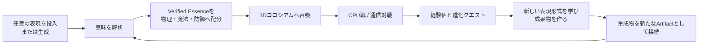
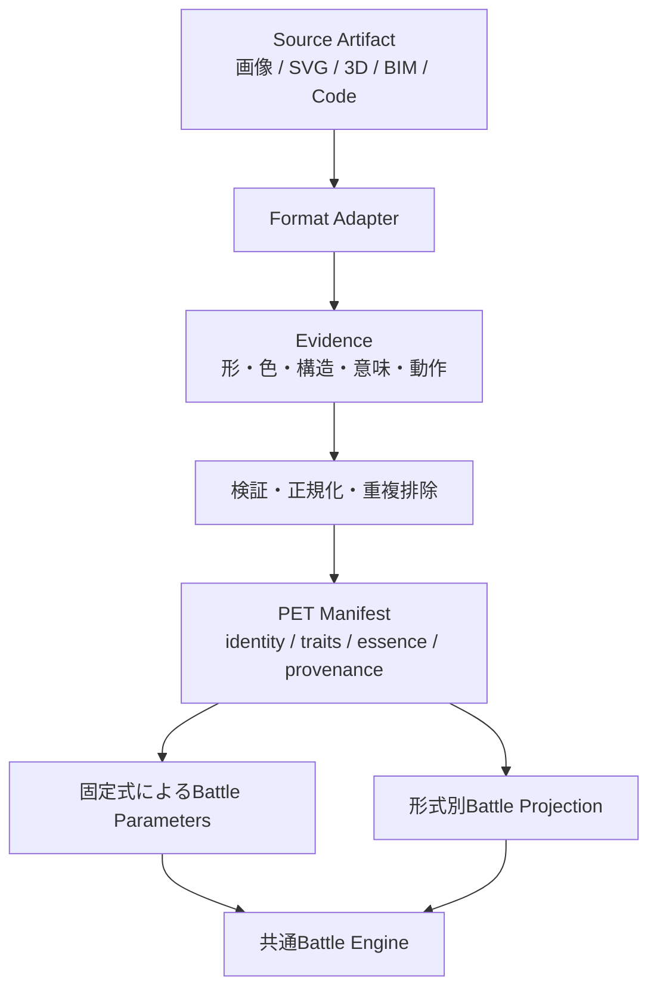
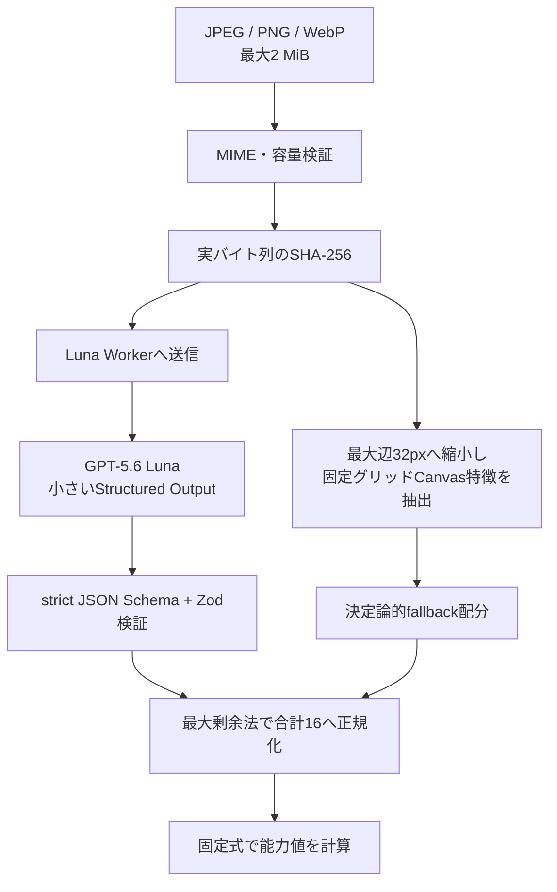
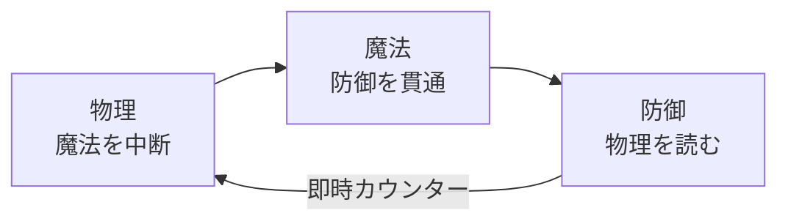
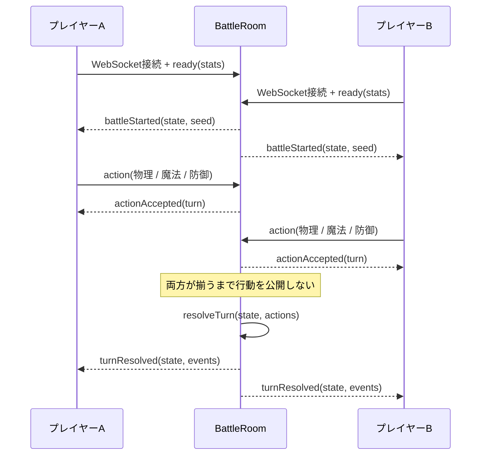
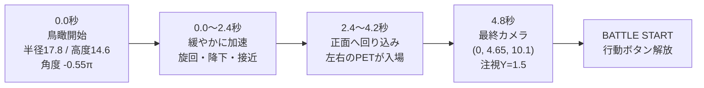
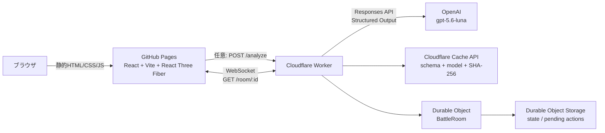

# PETBATTLE Product Blueprint

最終更新: 2026-07-18
対象: OpenAI Build Week提出、開発引継ぎ、将来の教育プログラム設計

## 1. プロダクト定義

> **PETBATTLEは、あらゆるデジタル表現を「意味」で生命化し、戦わせ、学んだ表現方法によって進化させる対戦型クリエイティブ学習プラットフォームである。**

最初に取り込む画像は、ペットが描かれた画像である必要はない。写真、落書き、図面、スクリーンショット、AI生成画像など、任意の表現をPETへ変換する。将来はSVG、PDF、3Dモデル、3Dプリンター用データ、IFC、コード、複合生成物まで同じ仕組みで扱う。

ここでいうPETは単なる画像ではない。

- **Artifact Core**: PETの同一性、レベル、進化履歴
- **Source Artifact**: 画像、ベクター、3D、構造データ、コード、生成物
- **Verified Essence**: Sourceから検証可能な意味だけを抽出した成長単位
- **Battle Projection**: Sourceを2Dカード、3Dホログラム、エフェクトへ投影した姿
- **Provenance**: 元データ、生成プロンプト、変換、テスト、SHA-256を結ぶ履歴

「トークン量がパラメータになる」という構想は、API課金上の生トークン数やファイル容量を直接強さにするものではない。PETBATTLEでは、検証を通った意味単位を **Verified Essence Token（画面上は「エッセンス」）** と呼び、その合計をレベル上限内で物理・魔法・防御へ配分する。暗号資産ではない。

## 2. 体験の中心ループ

現在の画面導線は「召喚 → 意味解析 → 3Dバトル → 進化」の4段階である。ハッカソン版は、この1周を短時間で理解できることを優先する。



重要なのは、生成が終点ではないことである。生成した画像、SVG、エフェクト定義、コード、3Dモデルは、次の解析入力と進化履歴になる。ゲーム内で作ったものが学習成果物として残り、その成果物が実際の対戦表現を変える。

## 3. 統一Artifactモデル

形式ごとの差はAdapterで吸収し、戦闘側は共通Manifestだけを見る。



現在実装されているManifestはLv.1画像用で、次を保持する。

- Source: `image`、`upload | generated`、SHA-256、MIME、バイト数
- Canvas特徴: 輝度、彩度、コントラスト、エッジ密度、左右対称性、暖色度、エントロピー、アルファ被覆率
- Luna認識: 名前、種族、属性、気質、特性、物理・魔法・防御エッセンス
- 解析元: `luna | fallback`
- 固定計算後の物理・魔法・防御・HP

Lv.2以降は、同じManifestへ形式固有のEvidenceとBattle Projectionを追加する。戦闘ルールへSVGやIFC固有の分岐を持ち込まないことが、拡張性の要点である。

## 4. レベル別の表現形式、容量、エッセンス

Lv.1だけが現在の実装値であり、Lv.2以降はロードマップ上の設計目標である。容量は受け付け可能な入力サイズであり、能力値ではない。エッセンス上限は表現の選択肢を増やすCore容量である。

| Core Level | 状態 | 主な形式 | 入力容量の目安 | エッセンス上限 | 学ぶ内容 |
|---|---|---|---:|---:|---|
| Lv.1 | 実装済み | JPEG / PNG / WebP | 2 MiB | 16 | 画像、色、構図、AIへの指示と意味認識 |
| Lv.2 | 設計目標 | SVG、段階的にPDF | 5 MiB | 32 | 座標、パス、レイヤー、ベクター表現 |
| Lv.3 | 設計目標 | GLB / OBJ / STL | 20 MiB | 64 | 頂点、面、法線、素材、3Dプリント |
| Lv.4 | 設計目標 | IFC / 3D PDF | 50 MiB | 128 | 部品階層、属性、関係、BIMの意味構造 |
| Lv.5 | 設計目標 | コード、アニメーション、複合Artifact | 100 MiB相当または分割入力 | 256 | 関数、状態、テスト、生成パイプライン |
| Expert | 将来研究 | RVT等の専門形式 | Connector契約による | コース別 | API、変換、業務データ連携 |

RVTはブラウザで直接解析する前提にしない。IFCへの書き出し、公式API、許諾されたConnectorなどを通じて扱う。大容量形式では、ファイル全体をWorkerへData URL送信するのではなく、オブジェクトストレージ、分割解析、サーバー側Adapterへ移行する。

レベル差のある通信対戦は、Core Levelまたはエッセンス上限でマッチングする。将来は、学習で得た選択肢を残しつつ合計値だけを揃える「正規化対戦」も用意し、成長が一方的な数値差にならないようにする。

## 5. 意味認識と水増し防止

### 5.1 現在のLv.1解析パイプライン



ローカル解析はネットワークやモデル出力に依存せず、同じCanvas特徴とseedから同じManifestを生成する。Luna Workerが未設定、タイムアウト、API障害の場合でも、ゲーム体験はfallbackで継続する。

Lunaは意味の配分だけを返し、能力値を直接返さない。現在の固定式は次の通りである。

```text
Ep + Em + Ed = 16

物理   = 24 + 6 × Ep
魔法   = 24 + 6 × Em
防御   = 20 + 7 × Ed
HP     = 96 + 2 × Ep + Em + 5 × Ed
```

### 5.2 不正な増量に対する防御

| 水増し方法 | 現在の防御 | 効果 |
|---|---|---|
| 巨大ファイル、EXIF、不要データ | 2 MiB制限。容量を能力計算へ使わない | バイト追加で強くならない |
| 単純な高解像度化 | 最大辺32pxの固定Canvas解析 | 同じ見た目のアップスケールで総量が増えない |
| 生APIトークンや長文の反復 | API使用量・文字数を能力計算へ使わない | 課金量や反復で強くならない |
| Lunaが過大な数値を返す | strict schema、Zod、合計16への再正規化 | AIは固定予算の配分しかできない |
| MIME偽装 | WorkerでJPEG/PNG/WebPのmagic bytesを照合 | 別形式の偽装を拒否する |
| 同一画像の再解析 | 実バイトSHA-256と、schema version・modelを含むCache Key | APIコストと結果のぶれを抑える |
| クライアントが勝敗を改変 | 共通の決定論的エンジンをWorker側でも実行 | 通信戦では同じstate/event列を両者へ配信する |

総エッセンスが固定なので、特徴を加工できても「総合値」は増えず、物理・魔法・防御のビルドが変わるだけである。Lv.2以降では、形式ごとに次の検証を加える。

- SVG: 重複path、不可視要素、極端に細かい無意味な点列を正規化
- 3D: 重複頂点、退化面、不可視内部メッシュを除外し、閉曲面などを検証
- Code: 文字数ではなくAST、実行可能性、自動テストの合格結果をEvidence化
- IFC: Entity数だけでなく、型、属性、関係の妥当性と一意性を検証
- 複合PET: SHA-256に加えてperceptual hashや構造hashを使い、同一Artifactの多重装備を防止

通信戦で送られる能力値は現在、型・整数・上限値で検証される。正式なランキング導入前には、Workerが署名したManifest IDから能力値を復元し、クライアント申告値を信頼しない方式へ移行する。

## 6. バトル設計

### 6.1 三すくみとカウンター

カウンターは4つ目のコマンドではなく、防御が物理を読んだ結果として発生する。



| 組合せ | 結果 |
|---|---|
| 物理 vs 魔法 | 物理が有利攻撃 |
| 魔法 vs 防御 | 魔法が有利攻撃 |
| 防御 vs 物理 | 防御側の防御値で即時カウンター |
| 物理 vs 物理 | 両者が同時攻撃 |
| 魔法 vs 魔法 | 両者が同時攻撃 |
| 防御 vs 防御 | 両者guard、ダメージなし |

有利攻撃は攻撃力に1.2倍、同種衝突は0.75倍を掛ける。魔法は相手防御の20%、物理は35%を差し引く。カウンターは防御値の0.9倍から相手防御の20%を差し引く。最終ダメージにはseed付きMulberry32による0.9〜1.1倍の揺らぎがあるため、同じ初期state、seed、行動列なら必ず同じ結果になる。

### 6.2 エフェクト

現在の3D Arenaには、行動ごとの専用演出とカメラ振動がある。

| Event | 表示名 | 通常時の長さ | 主な表現 |
|---|---|---:|---|
| physical | PHYSICAL STRIKE | 1.05秒 | 斬撃の飛翔とimpact |
| magic | ARCANE BURST | 1.50秒 | 魔法弾、粒子軌道、発光impact |
| defense | AEGIS GUARD | 1.65秒 | 盾の出現、保持、消失 |
| counter | PERFECT COUNTER | 1.42秒 | 盾で受け、反撃を飛ばし、impact |
| ko | KNOCK OUT | 2.25秒 | ビーム、破片、リング、敗者の沈下 |

通常攻撃のカメラ振動は0.62秒、KOは1.15秒である。`prefers-reduced-motion` 時は移動量を抑え、短縮演出へ切り替える。

## 7. 通信対戦

通信対戦はCloudflare WorkerとDurable Object `BattleRoom`を利用する。共有の`battle.ts`をブラウザとWorkerの両方から使うため、ルールの二重実装を避けている。



実装済みの通信基盤:

- `GET /room/:roomId?playerId=...` のWebSocket upgrade
- 1部屋2人、presence、ready、action受付
- 両者の行動が揃ってから一度だけターン解決
- Durable Object Storageへのroom stateとpending actionsの保存
- 再接続時の古い同一player socketの切断
- 切断通知、メッセージサイズ、ID、能力値の検証
- 同一のstateとevent列を全クライアントへ配信

メイン画面にはLOCAL / ONLINE切替、ルームID・プレイヤーID、接続、READY、対戦相手待機、秘密行動送信、切断・再接続表示を統合済みである。ONLINEではWorkerの`turnResolved`だけを正としてHPと3Dエフェクトを更新する。共有URL、行動タイムアウト、降参は将来範囲とする。暗号学的commit-revealは現在行っていないため、説明時は「Workerが行動を保留し、両者が揃ってから同時公開」と表現する。

## 8. 3D開始演出: 鳥瞰から旋回降下

開始演出は4.8秒の`easeInOutCubic`で、カメラがコロシアム上空を約189度旋回しながら、半径と高度を下げて正面構図へ入る。自分のPETが先に召喚台へ入り、伏せられていた敵PETは最後の0.7秒で初めて姿を現す。定位置へ並んだ後に`BATTLE START`を表示する。



| 時刻 | カメラとUI |
|---:|---|
| 0.0秒 | 半径17.8、高度14.6、角度-0.55π。注視点Y=0から開始 |
| 0.0〜4.8秒 | 角度を0.5πまで、半径を10.1まで、高度を4.65まで補間。注視点Yも1.5へ上げる |
| 2.5〜4.1秒 | 自分のPETを場外側から召喚台へスライドし、縮小状態から等倍へ整列 |
| 4.1〜4.8秒 | 封印されていた敵PETを初公開し、反対側の召喚台へ高速召喚 |
| 4.8秒 | `(x=0, y=4.65, z=10.1)`へ固定し、左右のホログラムを正面に収める |
| 完了直後 | `BATTLE START`を1.25秒フラッシュし、`onIntroComplete`で物理・魔法・防御ボタンを解放 |
| 5.6秒 | WebGL停止やタブ復帰でcallbackが来ない場合のUI側安全タイマー |

「SKIP INTRO」で即時に最終カメラへ移動できる。OSまたはpropsでreduced motionが指定された場合も、旋回降下を行わず即時完了する。これは演出品質だけでなく、アクセシビリティと操作不能防止を含むUX設計である。

## 9. 配備構成: GitHub Pages + Cloudflare Worker



### GitHub Pages側

- `main`へのpushまたは手動実行でGitHub Actionsを起動
- Node.js 24で`npm ci`、テスト、lint、production buildを実行
- `dist`をPages Artifactとして配備
- Actions上ではViteのbaseをGitHubリポジトリ名から自動設定
- Worker未設定でも、Canvas fallbackとCPU戦は動作する

### Worker側

- `POST /analyze`: Luna意味解析、CORS、入力検証、SHA-256、Cache API
- `GET /room/:id`: WebSocketをDurable Objectへ転送
- `OPENAI_API_KEY`: Cloudflare secretとして保持し、ブラウザへ渡さない
- `BATTLE_ROOMS`: `BattleRoom` Durable Object binding

ブラウザはbuild時の`VITE_LUNA_WORKER_URL`と`VITE_BATTLE_WORKER_URL`を参照する。Pages workflowはGitHub Actions Variablesから両方をbuild環境へ渡す。値が未設定でもローカル意味解析とCPU戦は機能し、通信戦の画面には設定方法を表示する。

## 10. 教育プログラムとしての価値

PETBATTLEは、ゲームの外に教材を置くのではなく、進化そのものを制作課題にする。

| 段階 | Evolution Questの例 | 学習成果 | バトルへの反映 |
|---|---|---|---|
| 画像 | プロンプトと構図を変えて同じ主題を表現 | AIリテラシー、色、構図、比較 | 属性、traits、エフェクト色 |
| SVG | pathとレイヤーを編集して紋章を作る | 座標、ベクター、分解と再構成 | 盾形状、精密な輪郭Evidence |
| Code | ループで粒子、関数で攻撃動作を作る | 反復、関数、デバッグ、テスト | 安全なEffect Recipeとして再生 |
| 3D | メッシュへ部品と素材を追加する | 空間認識、形状、法線、トポロジー | 3D Projection、物理・防御Evidence |
| BIM | IFC要素と関係を正しく組み立てる | 型、属性、階層、実世界データ | 構造traits、防御Evidence |

将来のAIメンターは答えを一括生成するのではなく、次を担当する。

- 現在のArtifactとエラーを読み、段階的なヒントを返す
- 学習者のレベルに合わせてQuestを小さく分解する
- 正解を主観的に採点せず、schema、構造検証、自動テストの結果を説明する
- 完成物がどのEvidenceとなり、なぜPETが変化したかを可視化する
- 元Artifact、試行、生成、修正、テスト合格を学習ポートフォリオとして残す

これにより、入口は対戦ゲームでも、最終的には「同じ対象を画像、ベクター、3D、BIM、コードでどう表現するか」を学ぶデジタル表現教育になる。特定のプログラミング言語だけでなく、AIと共に作り、検証し、別形式へ変換する能力を育てられる。

## 11. 審査4観点への対応

| 審査観点 | PETBATTLEが示すもの | 提出デモで見せる証拠 |
|---|---|---|
| 技術的な実装 | Responses APIの画像理解とStructured Output、Zod、決定論fallback、SHA-256 Cache、共有Battle Engine、WebSocket + Durable Object、React Three Fiber | 任意画像の解析結果、fallback切替、同じseedの再現性、2ブラウザ同一ターン、3Dエフェクト |
| デザインとユーザ体験 | 召喚・意味解析・旋回降下・三すくみ・進化を1本の物語にしたUI、skipとreduced motion | 1分以内で召喚から1戦、解析理由、HP、行動相性、結果が読める画面 |
| 潜在的なインパクト | 遊びを入口に、画像から3D/BIM/コードへ進む教育モデル。制作物がポートフォリオになる | Lv.2 Questの実動例と、学校・STEAM・専門教育へ伸びるレベル表 |
| アイデアの質 | 「ファイル量ではなく検証された意味が力」「生成物が次の入力」「あらゆる表現がPETになる」 | 16 essence固定の説明、全くPETらしくない入力が戦える姿へ変わる比較 |

## 12. ハッカソンMVPと将来範囲

### 12.1 現在実装済み

- JPEG / PNG / WebP、2 MiBのLv.1入力
- Canvas特徴と決定論的fallback Manifest
- GPT-5.6 Lunaの小さいStructured Outputを使う任意の意味解析
- 合計16エッセンスと固定能力値式
- 物理・魔法・防御・カウンターの決定論的Battle Engine
- LOCALのCPU戦とONLINEの2人対戦を切り替える画面体験
- 4.8秒の旋回降下、5種類の3Dエフェクト、skip、reduced motion
- WorkerのLuna endpoint、SHA-256 Cache設計、APIキー秘匿
- WebSocket/Durable Objectによる2人対戦基盤、共有プロトコル、READY・待機・秘密行動・切断UI
- GitHub Pages向けCI、テスト、production build

### 12.2 提出までのMVP必須項目

1. Workerを配備し、Pages用GitHub Actions Variablesへ2つの公開Worker URLを設定する
2. 2台または2ブラウザでREADY、秘密行動、同一ターン、切断・再接続を通し確認する
3. Lv.1勝利後に、1つだけ実際に完了できるLv.2 Evolution Questを入れる
4. Questの成果物が見た目またはエフェクトを変え、再戦へ戻る1周を完成させる
5. 共有URL、行動タイムアウト、降参のうちデモに必要な導線だけを追加する
6. 失敗、API未設定、通信切断でもデモを継続できる導線を確認する

教育カテゴリへ訴求するには、レベル表だけで終わらせず、「学ぶ → 作る → 検証される → PETが変わる」を少なくとも1回、実際に操作できる必要がある。ハッカソン版のQuestはSVGの色・path編集、または安全なJSON Effect Recipeの編集程度に絞る。

### 12.3 ハッカソン後

- 複数Artifactと進化履歴を持つPET Core
- SVG/PDF、GLB/OBJ/STL、IFC Adapter
- 生成画像、コード、3D生成物を直接Artifact Graphへ接続
- AIメンター、段階ヒント、自動評価、教師向け進捗画面
- Manifest署名、レベル別マッチング、正規化対戦、リプレイ
- アカウント、ポートフォリオ、Quest共有、コミュニティ大会
- オブジェクトストレージと非同期解析による大容量Artifact対応
- RVT等の専門形式を扱う許諾済みConnector

ハッカソンでは、全形式への対応数よりも、拡張可能な共通モデルと、Lv.1からLv.2へ進化する一貫した実動体験を優先する。

## 13. プロダクト原則

1. **意味が力になる。** 容量、課金額、反復データを力にしない。
2. **AIは配分と説明を助ける。** 勝敗と能力値式は検証可能なコードが決める。
3. **生成したものを次の入力にする。** 一度きりの生成デモで終わらせない。
4. **学習成果を画面上の変化にする。** クイズ正解ではなく制作物で進化する。
5. **通信戦はサーバー状態を正とする。** 両クライアントが別々に勝敗を計算しない。
6. **演出を操作性より優先しない。** skip、reduced motion、fallbackを必ず持つ。
7. **将来構想と実装済みを区別する。** デモで動く事実を中心に語る。

最終的な短いメッセージは次の通りである。

> **つくったものは、何でも戦える。学んだことが、そのまま進化になる。**
